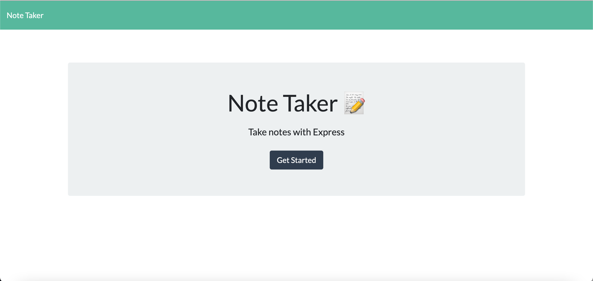
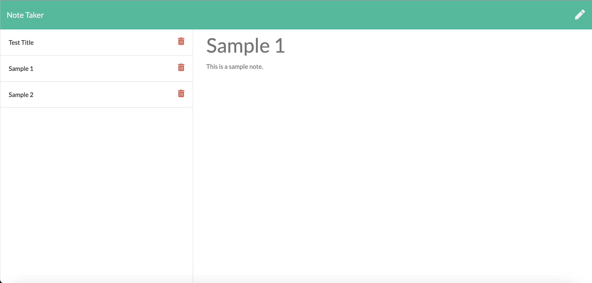

# Team Profile Generator
Project Owner: Aaron Au Yoong

Live Link: <Insert Live Link Here>

[](https://choosealicense.com/licenses/mit/)

## Table of Contents
* [Description](#Description)
* [License](#License)
* [Installation](#Installation)
* [Usage](#Usage)
* [Contributions](#Contributions)
* [Credits](#Credits)
* [Tests](#Tests)
* [Questions](#Questions)

## Description
Note Taker is an application that can be used to write and save notes. This application will use an Express.js back-end and will save and retrieve note data from a JSON file.

This application makes use of the following technologies:
* HTML
* CSS
* JavaScript
* Node JS
* Express JS
* UUIDV4
* Heroku (App Deployment)

## License
MIT License
<br>
Backend Code: Copyright © 2021-Present Aaron Au Yoong. All rights reserved.
<br>
Frontend Code: © 2021 Trilogy Education Services, LLC, a 2U, Inc. brand. Confidential and Proprietary. All Rights Reserved.


## Installation
If you would like to install the app to your local computer, please follow the installation steps below. 

1. Download this repository `note-taker`.

2. Install npm basic packages by running the following command in your bash/terminal:

````
npm i -y
````

3. Install the Express and UUID NPM Packages by invoking the below commands:

````
npm i express
npm i uuidv4
````

Congratulations! You have successfully installed the note taker application in your local computer. 

## Usage
If you prefer to use the live app deployed at Heroku, please visit the link here: <Insert Link Once Deployed>

If you have followed the instructions above and installed the application to your local device, please follow the instructions below regarding local usage. 

1. Ensure you have followed the installation instructions above.

2. Ensure the server is running by opening the `note-taker` folder in your terminal, and typing in:

````
$ node server.js
````

3. Open your web browser (I strongly recommend Google Chrome), and visit the link below (you may copy and paste the text):

`http://localhost:5000/`

4. Congratulations! You have successfully launched the note taker application. You will be shown the welcome page below:


5. Clicking on the "Get Started" button will bring you to the /notes application page (as shown below). You may now begin taking notes!
 

## Contributions
For contributions, you may follow the industry standard: [Contributor Covenant](https://www.contributor-covenant.org/)

## Credits
License badges used in this project were retrieved from GitHub user's `lukas-h` license-badge markdown file: [Markdown License badges](https://gist.github.com/lukas-h/2a5d00690736b4c3a7ba).

Basic NPM Packages were used: [NPM Packages](https://www.npmjs.com/).

For enabling the delete function in the application, the UUIDv4 was installed: [UUID NPM Package](https://www.npmjs.com/package/uuid).

Starter code provided by Monash Coding Bootcamp. 

## Tests
n/a


## Questions
Any questions? Feel free to contact me via my GitHub profile: [Aaron Au Yoong's GitHub Profile](https://github.com/aaronauyoong)
